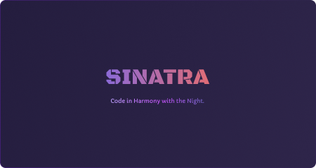
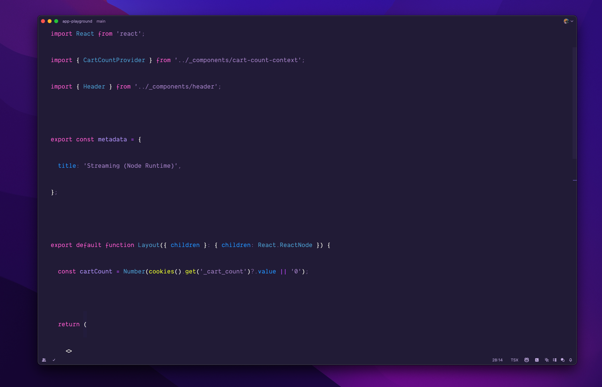
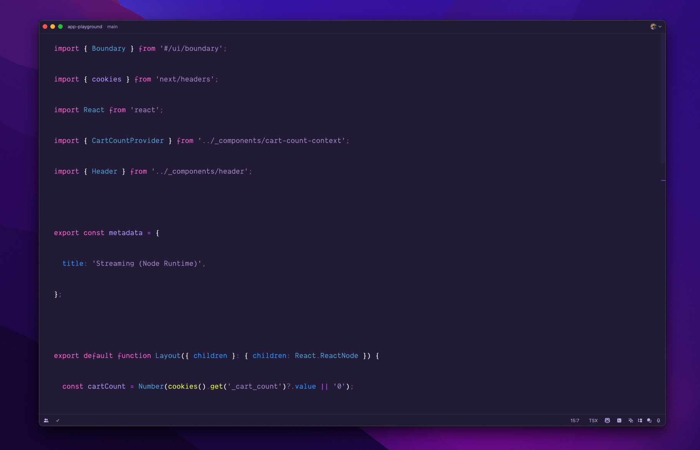

 <h1>Sinatra Theme</h1>

 

Feel the night with sinatra, a dark theme for [Zed](https://zed.dev)

#### Install
Download the zip file from [GitHub `.zip` download](https://github.com/xambassador/sinatra-zed-theme/archive/main.zip) option and unzip them.

#### Activating theme

1. Copy the `sinatra.json` file from `assets` folder to `~/.config/zed/themes`.
2. Select the theme (`Settings` ➡️ `Select Theme` ➡️ `Sinatra Dark`).
3. You are ready to go! 🚀

#### Preview
Sinatra comes with two flavors, `Sinatra Dark` and `Sinatra Dark Borderless`. If you like the borderless version, you can select it from the `Settings` ➡️ `Select Theme` ➡️ `Sinatra Dark Borderless`. I am fan of the minimalistic design, so I have tried to make zed to look like my minimal `VSCode` setup. You can copy the `settings.json` file and paste it in `~/.config/zed` folder to get the same look as mine. Make sure to backup your existing settings before pasting the new one.

##### Sinatra Dark Borderless

##### Sinatra Dark

